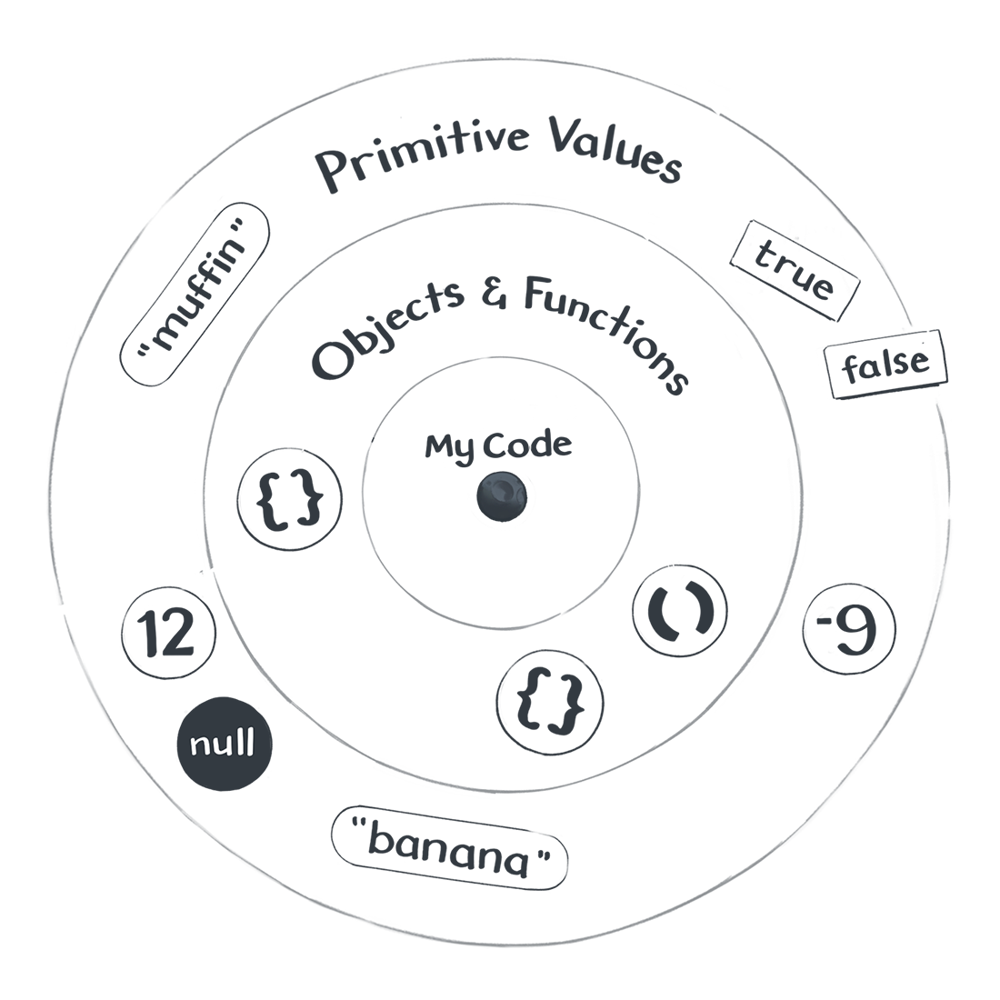
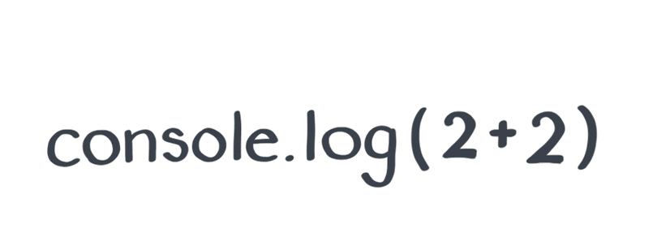
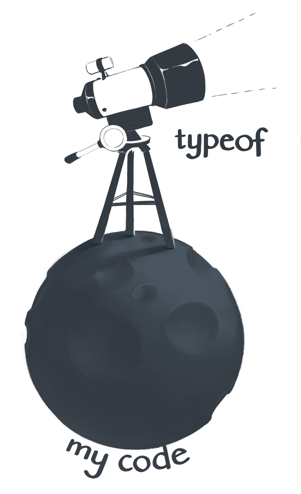

_In the beginning was the value._

_What is a value? It's hard to say._

This is like asking what a number is in math, or what a point is in geometry. **A value is a thing in the JavaScript universe.**

Numbers are values - but so are a few other things, like objects and functions. However, many things, such as an `if` statement or a variable declaration, are not values.

# Code and Values

To distinguish values from everything else in my JavaScript program, I like to imagine this drawing of the Little Prince by Antoine de Saint-Exupery:


I'm standing on a small asteroid - it is the code of my program.

On its surface, I see the `if` statements and variables declarations, commas, curly braces, and all the other things one might find in the JavaScript code.

My code contains instructions like "make a function call" or "do this thing many times", or even "throw an error". I walk through these instructions step by step - running errands from my small asteroid.

_But every once in a while, I look up._

On a clear night, I see the different values in the JavaScript sky: booleans, numbers, strings, symbols, functions and objects, `null` and `undefined` - oh my! I might refer to them in my code, but they don't exist _inside_ my code.

_In my JavaScript universe, values float in space._



"Hold on", you might say, "I always thought of values as being _inside_ of my code"! Here, I'm asking you to take a leap of faith. It will take a few more modules for this mental model to pay off. [Give it five minutes](https://signalvnoise.com/posts/3124-give-it-five-minutes?ck_subscriber_id=746096254)

Back to values. Broadly, there are two kinds of them.

## Primitive Values

**Primitive Values** are numbers and strings, among other things. Open your browser's console and print these primitive values using `console.log();`

```JavaScript
console.log(2);
console.log('hello');
console.log(undefined);
```

All primitive values have something in common. **There's nothing I can do in my code that would affect them.** This sounds a bit vague, so we'll explore what this means concretely in the next module. For now, I'll say that primitive values are like stars - cold and distant, but always there when I need them.

_That's the first kind of values._

## Objects and Functions

**Objects and Functions** are also values, but they are not primitive. This makes them very special. Go ahead and log a few of them to the browser console:

```JavaScript
console.log({});
console.log([]);
console.log(x=>x*2);
```

Notice how the browser console displays them differently from the primitive values. Some browsers might display an arrow before them, or do something special when you click them. If you have a few different browsers installed (e.g. Chrome and Firefox), compare how they visualize objects and functions.

Objects and functions are special because **I can manipulate them from my code**. For example, I can connect them to other values. This is rather vague so we'll refine this idea in a later module. For now, I can say that if primitive values are like distant stars, then objects and functions are more like rocks floating nearby my code. They're close enough that I can manipulate them.

_And that's the second kind of values._

You might have questions. Good. If you ask question, the JavaScript universe might answer it! Provided, of course, that you know how to ask.

## Expressions

There are many questions JavaScript can't answer. If you want to know whether it's better to confess your true feelings to your best friend or to keep waiting until you both turn into skeletons, JavaScript won't be of much help.

But there are some questions that JavaScript would be _delighted_ to answer.
These questions have a special name - they are called _expressions_.

If we "ask" the expression 2+2, JavaScript will "answer" with the value 4.

```JavaScript
console.log(2+2); //4
```

**Expressions are questions that JavaScript can answer. JavaScript answers expressions in the only way it knows how - with values.**



If the word "expression" confuses you, think of it as a piece of code that _expresses_ a value. You might hear people say that 2+2 "results in" or "evaluates to" 4. These are all different ways to say the same thing.

We ask JavaScript 2 + 2, and it answers with 4. **Expressions always result in a single value**. Now we know enough about expressions to be dangerous!

I previously said that there are many types of JavaScript values: numbers, string, objects, and so on. How do we know any particular value's type?

_This sounds like a question._ Do we dare to ask it?

## Checking a Type

At first, all values in the JavaScript cosmos might look the same - bright dots in the sky. But if you look closely, you'll realize there are fewer than ten different types of values. Values of the same type behave in similar ways.

If we want to check a value's type, we can ask it with the `typeof` operator.
JavaScript will answer our question with one of the predetermined string values, such as "number", "string", or "object".



Below are a few examples you can try in the browser console:

```JavaScript
console.log(typeof(2));//'number'
console.log(typeof('hello'));//'string'
console.log(typeof(undefined));//undefined'
```

Here, `typeof(2)` is an expression - and it results in the 'number' value.

Strictly saying, using parens isn't required with `typeof`. For example, `typeof 2` would work just as fine as `type(2)`. However, sometimes parens are required to avoid an ambiguity. One of the cases below would break if we omitted the parens after `typeof`. Try to guess which one it is:

```JavaScript
console.log(typeof({}));//'object'
console.log(typeof([]));//'object'
console.log(typeof(x=>x*2));//'function' this will not work without parens.
```

You can verify your guess in the browser console.


Now take another look at the last three examples - this time with close attention to their results. Did you find any of these results surprising? Why?

# Types of Values

As an aspiring astronomer, you might want to know about every type of value that can be observed in the JavaScript sky. After almost twenty five years of studying JavaScript, the scientists have only discovered nine such types:

## Primitive Values
