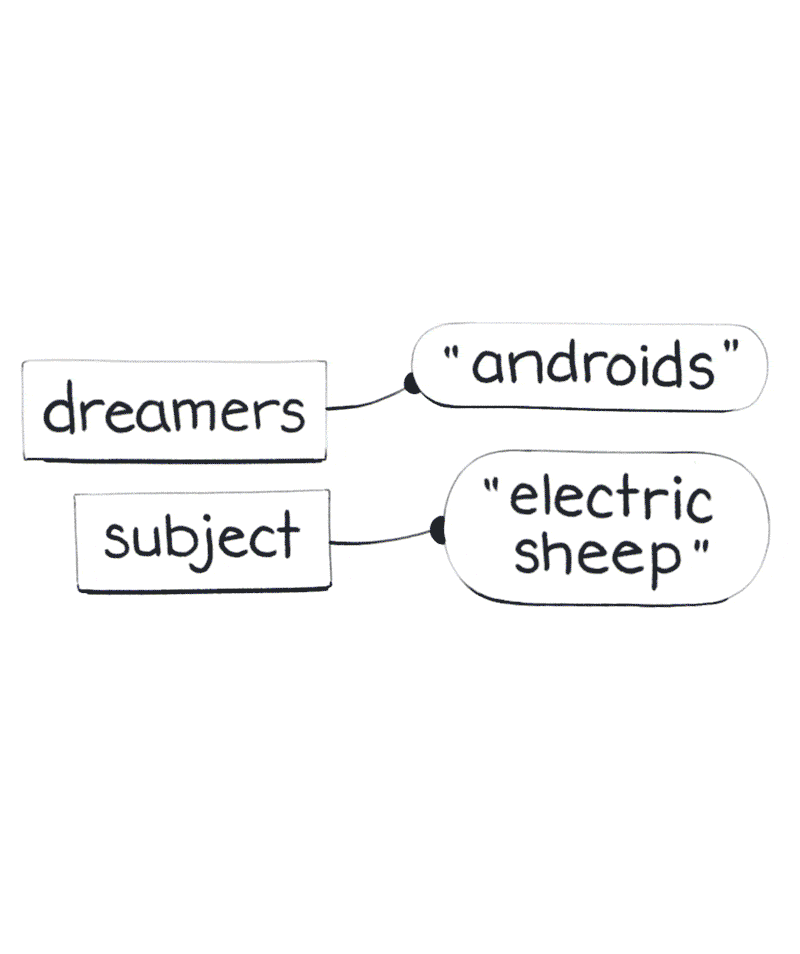
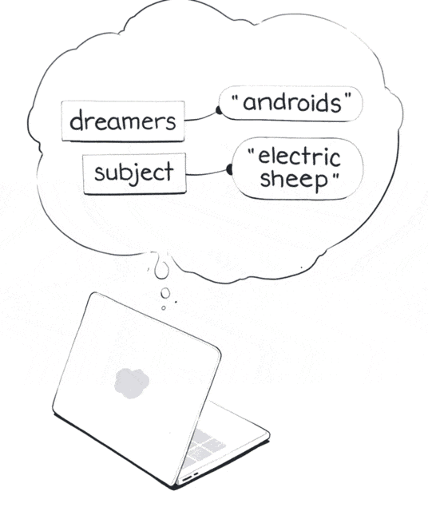
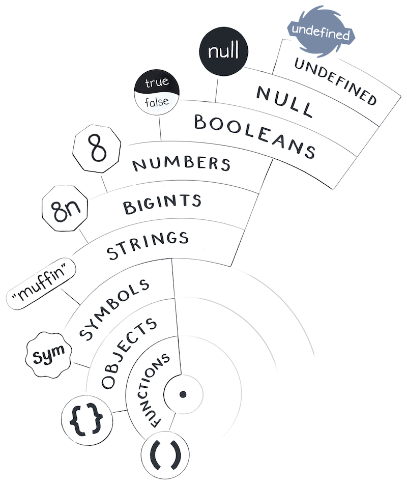

In this module, we'll take a closer look at the JavaScript world and the values in it.
But before we can get to that, we need to address the elephant in the room. Is the JavaScript world even real?

# The JavaScript Simulation

I live on my small asteroid inside the JavaScript universe.

When I ask the JavaScript world a question, it answers me with a value. I certainly don't come up with all these values by myself. The variables, the wires, the values - they all populate my world. The JavaScript world around me is absolutely real to me - just as the world you live in is real to you.

But sometimes, there is a moment of silence before the next line of code. An idle tick before the next function call. A glitch in the Matrix. During those moments, I see visions of a world that's much bigger than mine.



In the world that appears to me, there are no variables and values. No expressions and no literals. Instead, there are quarks, and atoms, and electrons, and water, and life. Perhaps, you are familiar with this world?

There, sentient beings called "humans" use special machines called "computers" to simulate my JavaScript universe. Some of them do it for amusement. Some of them do it for profit. Some of them do it for no reason at all. At their whim, my whole world gets born and dies a trillion times a day.

Maybe my JavaScript world isn't so real, after all.

This means there are two ways to study it.

## Studying From the Outside

One way to study my JavaScript world would be to study it from the outside.

Perhaps, you might focus on how a simulation of my world - a JavaScript engine - "really" works. For example, you might learn that this string of text - a value in my world - is a sequence of bytes stored inside a silicon chip.

This approach puts our mental focus on the physical world of people and computers. Some tutorials take this approach. But my approach is different.

## Studying From the Inside

We will be studying the JavaScript world from the inside. Transport yourself mentally into the JavaScript universe and stand next to me. We will observe its laws and perform experiments, like physicists do in the physical universe.

**We will learn about the JavaScript world for what it is - without thinking about how it's implemented. This is similar to how physicists can talk about properties of stars without answering the question whether the physical world is real. It doesn't matter! We can still describe it on its own terms.**

Our mental model does not attempt to answer questions like "How is a value represented in the computer memory?" The answer changes all the time! In fact, the answer to this question changes even [while your programming is running](https://v8.dev/blog/react-cliff?ck_subscriber_id=746096254). If you heard of a simple explanation about how JavaScript "really" represents numbers, strings, or objects in memory, it is most likely wrong.

To me, each string is a value. Not a "pointer" or a "memory address" - but a value. **In my universe, a value is good enough.** Don't allow "memory cells" and other low-level metaphors to distract you from building an accurate high-level mental model of JavaScript. It's turtles all the way down anyway!

If you're coming from a lower-level language, set aside your intuitions about "passing by reference", "allocating on stack", "copying on write", and so on. These models of how a computer works often make it harder to be confident what can or cannot happen in a JavaScript program. We'll look at some of the lower level details, but only [where it really matters](https://www.joelonsoftware.com/2002/11/11/the-law-of-leaky-abstractions/?ck_subscriber_id=746096254). They can serve as an addition to our mental model, rather than its foundation.

**Instead, the foundation of our mental model is that our world is full of values.**
Each value belongs to one of a few built-in types. Some of them are primitive, which makes values of those immutable. Variables are "wires" pointing from names in our code to values. And we'll keep building on the foundation.

As for these strange visions, I don't pay as much thought to them anymore. I have wires to point, questions to ask, and functions to call. I better get to it!

The stars are bright when I look at them.

Are they still there when I blink?

I shrug.

"Implementation details"



# Counting the Values

Count von count was my childhood role model. If you're not familiar with him from the Sesame Street, his favorite pastime is counting things. Today, Count von count will join us in counting every value in the JavaScript universe.

You might wonder: what's the point of counting values? We're not in an arithmetics class, are we? The essence of counting is to distinguish things from one another. You can only say there are "two apples" when you clearly see that they're two distinct apples. Distinguishing values from one another is key to understanding equality in JavaScript - which will be our next topic.

Like Virgil guided Dante through the nine circles of Hell, Count von count will accompany us through the "celestial spheres" of JavaScript to meet different values: Booleans, Numbers, Strings, and so on. Consider it a sightseeing tour.



# Undefined

We'll start our tour with the Undefined type. Count von count will be pleased to know that **there is only one value of that type - undefined**

```JavaScript
console.log(typeof(undefined));//undefined
```


It's called undefined so you might think it's not there - but it is a value, and a very real one! Like a black hole, `undefined` is grumpy and can often spell trouble. For example, reading a property from it will break your program:

```JavaScript
let person = undefined;
console.log(person.mood);//TypeError!
```

oh, well. Luckily, there is only one undefined in the entire JavaScript universe. You might wonder: why does it exist at all? JavaScript, it represents the concept of an unintentionally missing value.

You could use it in your own code by writing `undefined` - like you write 2 or 'hello'. However, `undefined` also commonly "occurs naturally". It shows up in some situations where JavaScript doesn't know what value you wanted. For example, if you forget to assign a variable, it will point to `undefined`:

```JavaScript
let bandersnatch;
console.log(bandersnatch); // undefined
```


Then you can point it to another value, or to `undefined` again if you want.

Don't get too hung up on its name. It's tempting to think of `undefined` as some kind of variable status, e.g. "this variable is not yet defined". But that's a completely misleading way to think about it! In fact, if you read a variable that was actually not defined (or before the `let` declaration), you will get an error:

```JavaScript
console.log(jabberwocky);// ReferenceError!
let jabberwocky;
```

That has nothing to do with undefined.

Really, `undefined` is a regular primitive value, like 2 or 'hello'.

Handle it with care.
