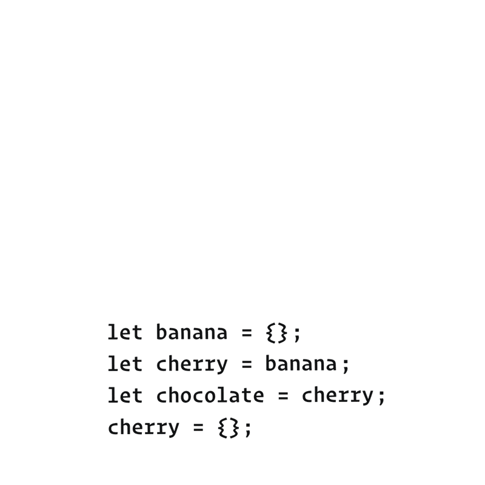
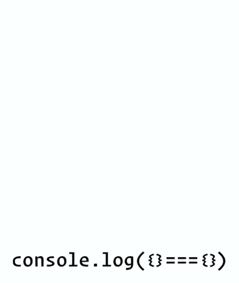

It's time to talk about equality in JavaScript! Here's why it matters.

Imagine negotiating business deals at a masked carnival. You might talk to two people, and not realize that you really talked to the same person twice. Or you might think you talked to one person but those were two different people!


**If you don't have a clear mental model of equality in JavaScript, every day is like a carnival - and not in a good way.** You're never quite sure if you're dealing with the same value, or with two different values. As a result, you'll often make mistakes - like changing a value you didn't intend to change.

Luckily, we've already done most of the work to establish the concept of equality in JavaScript. It fits into our mental model in vary natural way.

# Kinds of Equality

In JavaScript, there are several kinds of equality. If you've been writing JavaScript for a while, you're probably familiar with at least two of them:

- **Strict Equality**: `a === b` (triple equals).
- **Loose Equality**: `a == b` (double equals).
- **Same Value Equality**: `Object.is(a , b)`.

Most tutorials don't mention the Same Value Equality at all. We'll take a road less traveled, and explain it first. We can then use it to explain the other kinds.

## Same Value Equality: Object.is(a, b)

In JavaScript, `Object.is(a, b)` tells us if `a` and `b` are the same value:

```JavaScript
console.log(Object.is(2,2));//true
console.log(Object.is({},{}));//false
```

This is called **Same Value Equality**

What does "same value" means, exactly, in our mental model? You might already know this intuitively, but let's verify your understanding.

## Check Your Intuition

Consider this example from the Counting the Values exercises:

```JavaScript
let dwarves = 7;
let continents = '7';
let worldWonders = 3 + 4;
```

As a reminder, our sketch for this snippet looked like this:


Now try to answer these questions **using the diagram above**

```JavaScript
let dwarves = 7;
let continents = '7';
let worldWonders = 3 + 4;

console.log(Object.is(dwarves, continents));// false
console.log(Object.is(continents, worldWonders));// false
console.log(Object.is(worldWonders, dwarves));// true
```

Write down your answer and think about how you would explain them.

This was not a trick question! Here are the answers:

1. `Object.is(dwarves, continents)` is `false` because `dwarves` and `continents` **point at different values.**

2. Object.is(continents, worldWonders) is `false` because `continents` and `worldWonders` **point at different values.**

3. `Object.is(worldWonders, dwarves)` is `true` because `worldWonders` and `dwarves` **point at the same value.**

If two values are represented by a single shape on our diagram, it means that they aren't really two different values. They are the same value! And that is the case for which `Object.is(a, b)` return `true`.

In the previous module, we "counted" the values. But really, we were learning about what makes values distinct from one another. And as a result, we also learned the opposite - what it means for values to be the same.

If you struggle with this idea, you might want to revisit Counting the Values and [work through the exercises for it again.](https://eggheadio.typeform.com/to/STEeMy?email=andylauszp@gmail.com&ck_subscriber_id=746096254) It will make sense, I promise!

## But What About Objects?

By this point, you might be worried about objects. You might have heard that equality doesn't work with objects, or that it compares "reference". **If you have existing intuitions like these, set them aside completely for a moment.**

Instead, look at this code snippet:

```JavaScript
let banana = {};
let cherry = banana;
let chocolate = cherry;
cherry = {};
```

Open a notepad or a [sketching app](https://excalidraw.com/) and draw a diagram of variables and values. You'll want to draw it step by step, as it's hard to do in your head.

Remember that `{}` always means "create a new object value". Also remember that `=` means "connect the left side's wire to the value on the right side".

**After you finish drawing,** write down your answers to these questions:

```JavaScript
let banana = {};
let cherry = banana;
let chocolate = cherry;
cherry = {};

console.log(Object.is(banana, cherry));//false
console.log(Object.is(cherry, chocolate));//false
console.log(Object.is(chocolate, banana));//true
```

Make sure to **use your diagram** to answer them.

Your drawing process should have followed these steps:



1. **let banana = {};**

   - Declare a `banana` variable.
   - Create a new object value `{}`.
   - Point `banana` variable wire to it.

2. **let cherry = banana;**

   - Declare a `cherry` variable.
   - Point `cherry's` wire to where `banana` is pointing.

3. **let chocolate = cherry;**

   - Then, we declare a `chocolate` variable.
   - Point `chocolate's` wire to where `cherry` is pointing.

4. **cherry = {};**

   - Create a new object value {}.
   - Point `cherry's` wire to is.

After the last step, your diagram should look like this:


Now let's check your answers:

1. `Object.is(banana, cherry)` is **false** because `banana` and `cherry` **point at different values.**

2. `Object.is(cherry, chocolate)` is **false** because `cherry` and `chocolate` **point at different values.**

3. `Object.is(chocolate, banana)` is **true** because `chocolate` and `banana` **point at the same value.**

As you can see, we didn't need any additional concepts to explain how **Same Value Equality** works for objects. It naturally falls out of mental model.

And that's all there is know about it!

# Strict Equality: a === b

You have probably used the **Strict Equality** operator before:

```JavaScript
console.log(2 === 2);//true
console.log({} === {});//false
```

There is also a corresponding opposite `!==` operator.

## Same Value Equality vs Strict Equality

So what's the difference between `Object.is` and `===`?

**Same Value Equality** - `Object.is(a, b)` - has a direct meaning in our mental model. It corresponds to the idea of "the same value" in our universe.

In almost all cases, the same intuition works for **Strict Value Equality** too. For example, `2 === 2` is `true` because 2 always "summons" the same value:


Conversely, `{} === {}` is `false` because each `{}` creates a different value:



In the above examples, `a === b` behaves the same way as `Object.is(a, b)`. However, there are **two rare cases** where the behavior of `===` is different.

**Consider the cases below as exceptions to the rule** - just like you had to memorize the irregular verbs when you were learning English. Both of these unusual cases involve "special numbers" that we discussed in the past:

1. **NaN === NaN is false**, although they are the value.
2. **-0 === 0 and 0 === -0 are true**, although they are different values.

Although these cases are uncommon, we'll take a closer look at both of them.

## Fist Special Case: NaN

As we've seen in Counting the Values, NaN is a special number that shows up when we do invalid math like 0 / 0:

```JavaScript
let width = 0 / 0; //NaN
```

Further calculations with NaN will give you NaN again:

```JavaScript
let height = width * 2; //NaN
```

You probably won't do this intentionally, but it can happen when you work with incorrect data in the first place, or if your calculation contains a mistake.

**Remember that NaN === NaN is always false:**

```JavaScript
console.log(width === height); //false
```

However, NaN is the same value as NaN:

```JavaScript
console.log(Object.is(width, height)); //true
```


That's confusing.

The reason for NaN === NaN being `false` is largely historical so I suggest to accept it as a fact of life. You might run into this if you try to write some code that checks a value for being NaN(for example, to print a warning).

```JavaScript

function resizeImage(size){
    if (size === NaN) {
        //Doesn't work: the check is always false!
        console.log('Something is wrong');
    }
    //...
}
```

Instead, here's a few ways (they all work!) to check if `size` is NaN:

- Number.isNaN(size)
- Object.is(size, Nan)
- size !== size

The last one might be particularly surprising. Give it a few moments. If you don't see how it detects NaN, try re-reading section and thinking again.

(There will be an answer at the end of this module.)

## Second Special Case: -0

In regular math, there is no such concept as "minus zero", but it exists in floating point math for [practical reasons.](https://softwareengineering.stackexchange.com/questions/280648/why-is-negative-zero-important/280708#280708). Here's an interesting fact about it.

**Both 0 === -0 and -0 === 0 are always true:**

```JavaScript
let width = 0; // 0
let height = -width; // -0
console.log(width === height); // true
```

However, 0 is different value from -0:

```JavaScript
console.log(Object.is(width, height));//false
```


That's confusing too.

In practice, I haven't run into a case where this matters in my entire career.

## Code Exercise

Now that you know how `Object.is` and `===` work, I have a small coding exercise for you. You don't have to complete it, but it's a fun brainteaser.

**Write a function called strictEquals(a, b) that returns the same value as a === b. Your implementation must not use the === or !== operators.**

```JavaScript
function strictEquals(a, b) {
    if (Number.isNaN(a) || Number.isNaN(b))
        return false;

    if ((Object.is(a, 0) && Object.is(b, -0)) ||
    (Object.is(a, -0) && Object.is(b, 0)))
        return true;

    return Object.is(a, b);
}
```

Here is the answer from [Dan](https://gist.github.com/gaearon/08a85a33e3d08f3f2ca25fb17bd9d638?ck_subscriber_id=746096254) if you want to check yourself. This function is utterly useless, but writing it helps make sense of `===`.

## Don't Panic

Hearing about these special numbers and how they behave can be overwhelming. Don't stress too much about these special cases!

They're not very common. Now that you know that they exist, you will recognize them in practice. And in most cases, our intuition about what "same value" means is useful for both `Object.is(a, b)` and `a === b`.

# Loose Equality

Finally, we get to the last kind of equality.

**Loose Equality** (double equals) is the bogeyman of JavaScript.

Here's just a couple of examples to make your skin crawl:

```JavaScript
console.log([[]] == '');//true
console.log([1] == true);//true
console.log([0] == false);//true
```

[Wait, what?!](https://dorey.github.io/JavaScript-Equality-Table/)

The rules of **Loose Equality** (also called "abstract equality") are arcane and confusing. They are widely acknowledged as an early bad design decision. Many coding standards prohibit the use of `==` and `!=` in code altogether.

Although Just JavaScript doesn't take strong opinions on what features you should or shouldn't use, we're not going to cover **Loose Equality** for now, it's uncommon in modern codebases, and its rules don't play a large role in the language - or in our mental model. If you are curious, check out [how it works,](https://developer.mozilla.org/en-US/docs/Web/JavaScript/Equality_comparisons_and_sameness?ck_subscriber_id=746096254#Loose_equality_using) but don't feel pressured to memorize it. You'll need memory for other topics!

There is one usage of it that is relatively common and is worth knowing:

```JavaScript
if (x == null) {
    //...
}
```

This code is equivalent to writing:

```JavaScript
if (x === null || x === undefined) {
    //...
}
```

However, even that usage of `==` might be controversial on some teams. It's best to discuss as a team how much `==` is tolerated in your codebase first.

# Recap

- JavaScript has several kinds of equality. They include **Same Value Equality, Strict Equality,** and **Loose Equality.**

- **Same Value Equality**, or `Object.is(a, b)`, matches the concept of the sameness of value that we introduced in the previous module.

  - Understanding this kind of equality helps prevent bugs! You will often need to know when you're dealing with the same value, and when you're dealing with two different values.
  - When we draw a diagram of values and variables, the same value cannot appear twice on it. `Object.is(a, b)` is `true` when variable `a` and `b` point to the same value on our diagram.
  - **Same Value Equality** is the easiest to explain, which is why we started with it. However, it's verbose and a bit annoying to write.

- In practice, you will use **Strict Equality**, or `a === b`, most often. It is equivalent to the **Same Value Equality** except for two rare special cases:

  - `NaN === NaN` is `false`, even though they are the same value.
  - `0 === -0 and -0 === 0` is `true`, but they are different values.

- You can check whether `x` is `NaN` using `Number.isNaN(x)`.

- **Loose Equality** (==) is a set of arcane rules and is often avoided.

Finally, you might still be wondering why `size !== size` works as a way to detect when `size` is `NaN`. We said we'd revisit this question at the end of this module. This works because `NaN === NaN` is `false`, as we already learned. So the reverse (`NaN !== NaN`) must be `true`. Since `NaN` is the only value that's not equal to itself, `size !== size` can only mean that `size` is `NaN`.

In fact, ensuring you can detect `NaN` this way was [one of the original reasons](https://stackoverflow.com/questions/1565164/what-is-the-rationale-for-all-comparisons-returning-false-for-ieee754-nan-values/1573715#1573715) for making `NaN === NaN` return `false`! This was decided before JavaScript even existed. This is a purely historical anecdote, but interesting nonetheless.

# Exercises

This module also has exercises for you to practice!

[Here](https://eggheadio.typeform.com/to/wpQKI4?email=andylauszp@gmail.com&ck_subscriber_id=746096254)

**Don't skip them!**

Even though you're probably familiar with the concept of equality, these exercises will help you cement the mental module we're building. We need this foundation before we can get to more complex topics.

I'm still working on the next module. You can except to see it in a week or so.
