In the previous module about Properties, we introduced the mystery of Sherlock Holmes moving to Malibu. But we haven't explained yet.

**This time, we will draw the diagrams step by step together** so you can check your mental model.

Though you have tried it on your own earlier, extra practice can't hurt! At the end of this module, we'll discuss the larger lesson behind this example.

# Step 1: Declaring the `sherlock` Variable

We started with this variable declaration:

```js
let sherlock = {
  surname: "Holmes",
  address: {
    city: "London",
  },
};
```

Your diagram should end up looking like this:

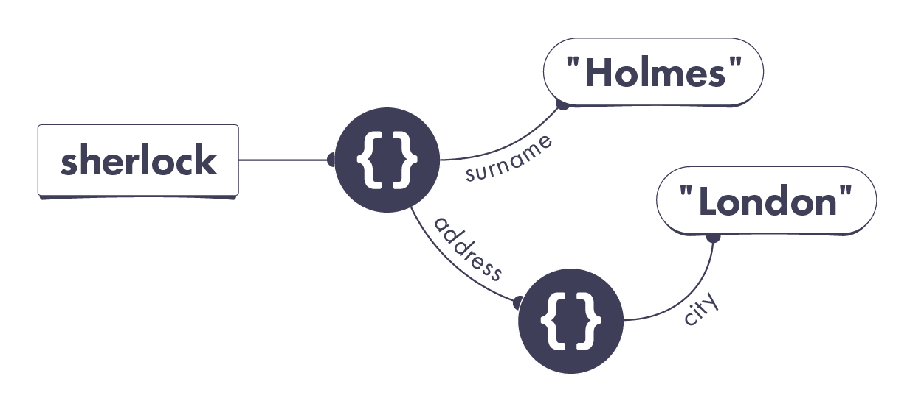

There is a `sherlock` variable pointing at an object. That object has two properties. Its `surname` property points at the `"Holmes"` string value. Its `address` property points at another object. That other object only has one property called `city`. That property points at the `"London"` string value.

Take a close look at my process for drawing this diagram:

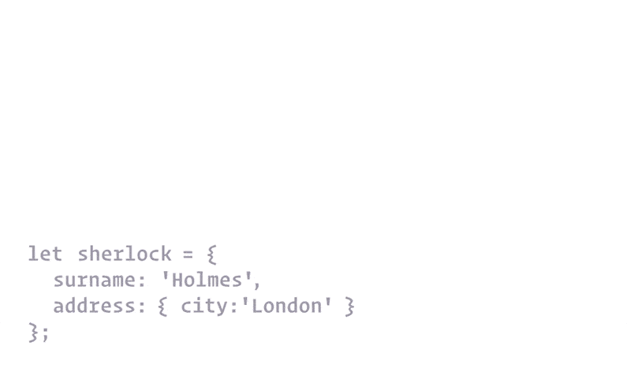

Was your process similar?

# No Nested Objects

Notice that we have not one, but two completely separate objects here. Two pairs of curly braces means two objects.

**Objects might appear "nested" in code. but in our universe each object is completely separate. An object cannot be "inside" of other object!**

If you still think of objects as nested, try to get rid of this idea now.

# Step 2: Declaring the john Variable

In this step, we declare another variable:

```js
let john = {
  surname: "Watson",
  address: sherlock.address,
};
```

Edit the diagram you drew earlier to reflect these changes.

Your additions to the diagram should look like this:

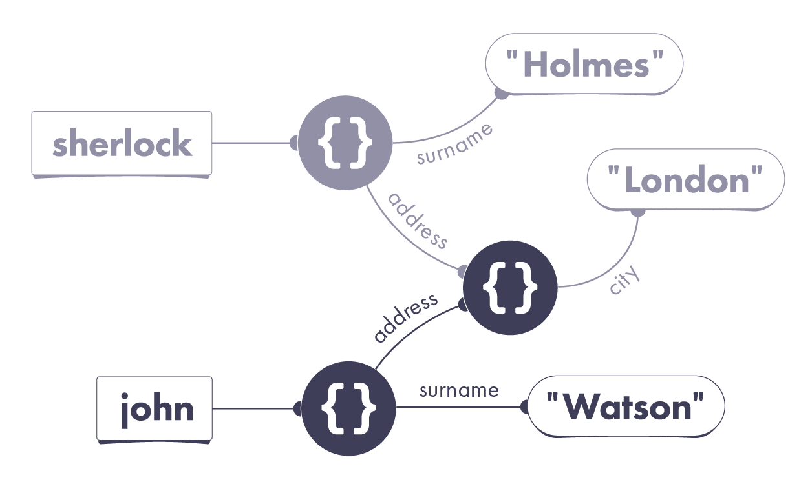

There is now also a `john` variable. It points at an object with two properties. Its `address` property points at the same object that `sherlock.address` is already pointing at. Its `surname` property points at the `'Watson'` string.

Take a look at my process in more detail:

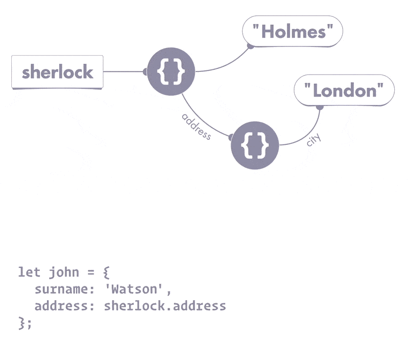

# Properties Always Point at Values

When you see `address: sherlock.address`, it is tempting to think that John's `address` property points at the Sherlock's `address` property.

This is misleading.

**Remember: a property always points at value! It can't point at another property or a variable. In general, all wires in our universe point at values.**

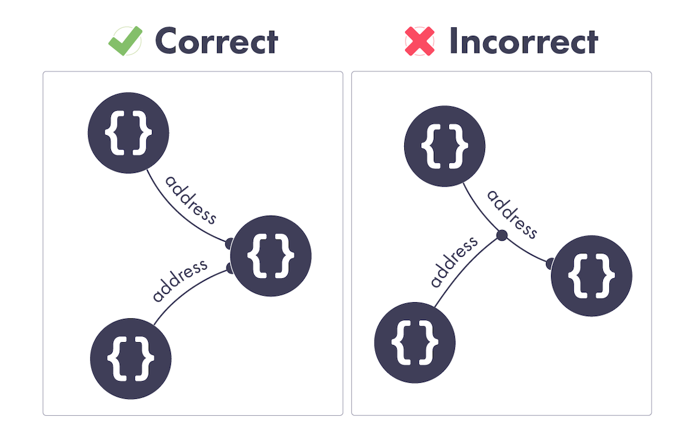

When we see `address: sherlock.address`, we must figure out the value of `sherlock.address`, and point the `address` property wire at that value. It's the value itself that matters, not how we found it (`sherlock.address`).

As a result, there are now two different objects whose `address` properties point at the same object. Can you spot them both on the diagram?

# Step 3: Changing the Properties

Now let's recall the last step of our example from the Properties module.

John has an identity crisis, and gets sick of the London drizzle. He decides to change his name and move to Malibu. We did this by setting a few properties:

```js
john.surname = "Lennon";
john.address.city = "Malibu";
```

How do we change the diagram to reflect it?

Your diagram should now look like this:

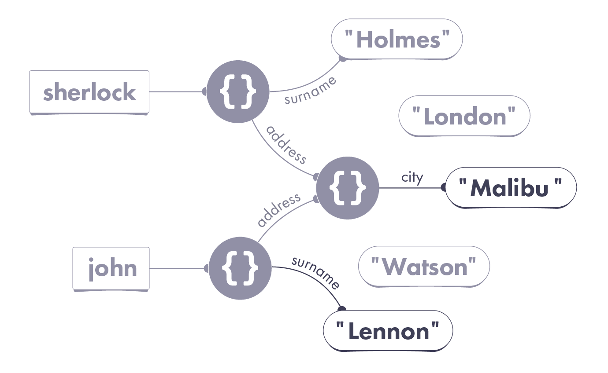

The object that the `john` variable points at now has its `surname` property pointing at the "Lennon" string value. More interestingly, the object that both `john` and `sherlock's address` properties are pointing at now has different `city` property value. It is now pointing at the "Malibu" string.

In a strange case of location hijacking, both Sherlock and John have ended up in Malibu. Follow the wires using the diagram and verify this is correct:

```js
console.log(sherlock.surname); // "Holmes"
console.log(sherlock.address.city); // "Malibu"
console.log(john.surname); // "Lennon"
console.log(john.address.city); // "Malibu"
```

Here is my process for the last series of changes:

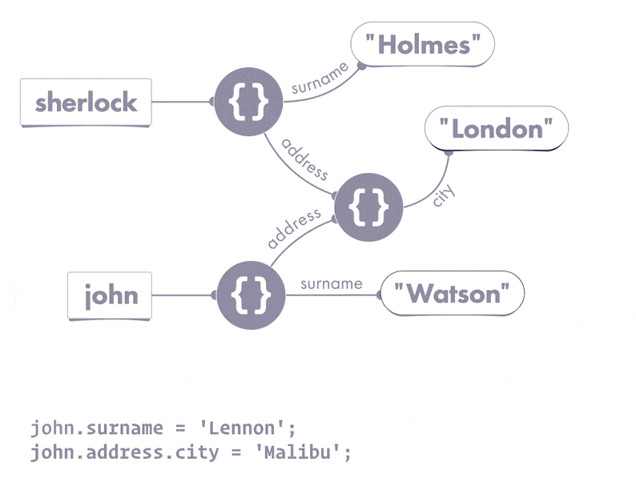

We figure out the wire, then the value, and finally point the wire to that value.

The result should make sense now, but this example is confusing on a deeper level. Where is the mistake in it? How do we actually fix the code so that John moves to Malibu alone? To make sense of it, we need to talk about mutation.

# Mutation

Mutation is a fancy way of saying "change".

**For example, we could say that we changed an object's property, or we could say that we mutated that object (and its property). This is the same thing.**

People like to say "mutate" because this word has a sinister undertone. It reminds you to exercise extra caution. This doesn't mean mutation is "bad" - it's just programming! - but that you need to be very intentional about it.

Let's recall your original task. We wanted to give John a different surname, and move him to Malibu. Now let's look at our two mutations:

```js
// Step 3: Changing the Properties
john.surname = "Lennon";
john.address.city = "Malibu";
```

Which objects are being mutated here?

The first line mutates the object `john` points at - concretely, its `surname` property. This makes sense: indeed, we mean to change John's surname. That object represents John's data. So we mutate its `surname` property.

However, the second line does something very different. It doesn't mutate the object that `john` points at. Rather, it mutates a completely different object - the one we can reach via `john,address`. And if we look at the diagram, we know it's the same object that we can also reach via `sherlock.address`!

**By mutating an object used elsewhere in the program, we've made a mess.**

# Possible Solution: Mutating Another Object

One way to fix this would be to avoid mutating shared data:

```js
// Replace Step 3 with this code:
john.surname = "Lennon";
john.address = { city: "Malibu" };
```

The difference in the second line is subtle, but very important.

When we had `john.address.city = "Malibu"`, the wire on the left was `john.address.city`. We were mutating the `city` property of the object reachable via `john.address`. But the same object was also reachable via `sherlock.address`. As a result, we unintentionally mutated shared data.

With `john.address = { city: "Malibu" }`, the wire on the left is `john.address`. We are mutating the `address` property of the object that `john` points at. In other words, we are only mutating the object representing John's data. This is why `sherlock.address.city` remains unchanged:

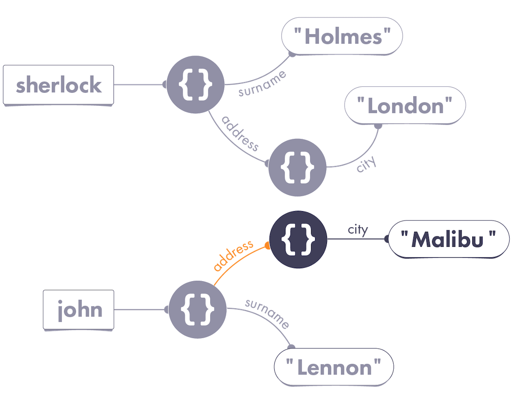

As you can see, visually similar code may produce very different results. Always pay attention to which wire is on the left side of an assignment!

# Alternative Solution: No Object Mutation

There is also another way we can make `john.address.city` give us `"Malibu"` while `sherlock.address.city` continues to say `"London"`:

```js
// Replace Step 3 with this code:
john = {
  surname: "Lennon",
  address: { city: "Malibu" },
};
```

Here, we don't mutate John's object at all. Instead, we reassign the `john` variable to point at a "new version" of John's data. From now on, `john` points at a different object, whose `address` also points at a completely new object:

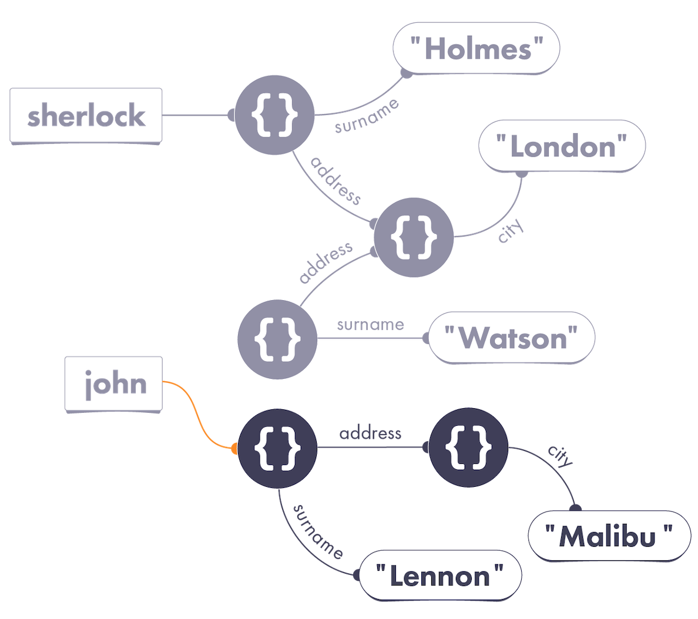

You might notice there's now an "abandoned" old version of the John object on our diagram. We don't need to worry about it. JavaScript will eventually automatically remove it from memory if there are no wires pointing at it.

Note that both of these approaches satisfy all of our requirements:

```js
console.log(sherlock.surname); // "Sherlock"
console.log(sherlock.address.city); // "London"
console.log(john.surname); // "Lennon"
console.log(john.address.city); // "Malibu"
```

Compare their diagrams. Do you have a personal preference for either of these fixes? What are , in you opinion, their advantages and disadvantages?

# Learn from Sherlock

Sherlock Holmes once said: "when you have eliminated the impossible, whatever remains, however improbable, must be the truth."

**As your mental model becomes more complete, you will find it easier to debug problems because you will know what possible cause to look for.**

For example, if you know that `sherlock.address.city` has changed after running some code, the wires from our diagram suggest three explanations:


1. Maybe the `sherlock` variable was reassigned.
2. Maybe the object we could reach via `sherlock` was mutated, and its `address` property was set to something different.
3. Maybe the object we could reach via `sherlock.address` was mutated, and its `city` property was set to something different.

Your mental model gives you a starting point from which you can investigate bugs. **This works the other way around too.** Sometimes, you can tell a piece of code is not the source of a problem - because the mental model proves it!

Say, if we point the `john` variable to a different object, we can be fairly sure that `sherlock.address.city` won't change. Our diagram shows that changing the `john` wire doesn't affect any chains starting whit `sherlock`:

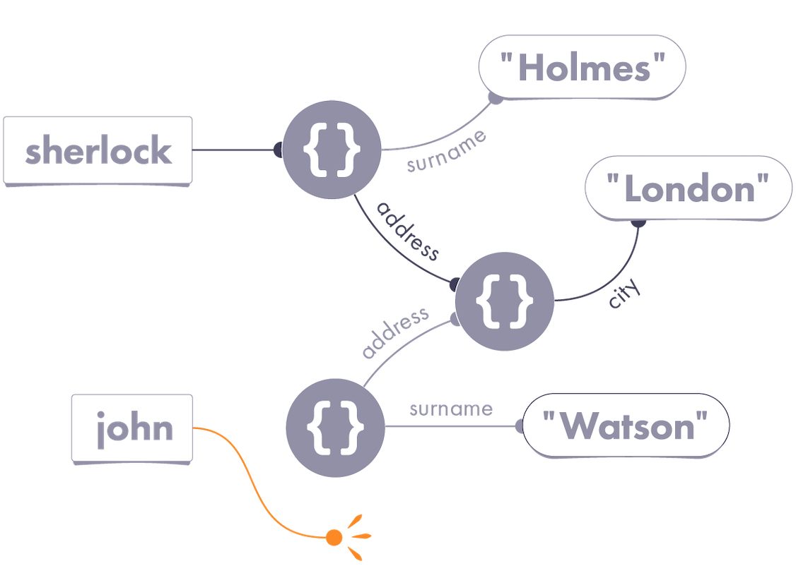

Still, keep in mind that, unless you're Sherlock Holmes, you can rarely be fully confident in something. This approach is [only as good as](https://rationalwiki.org/wiki/Holmesian_fallacy?ck_subscriber_id=746096254#Explanation) your mental model! Mental models will help you come up with theories, but you need to devise experiments so you can confirm them with `console.log` or a debugger.

# Let vs Const

It is worth nothing you can use the `const` keyword as an alternative to `let`:

```js
const shrek = { species: "ogre" };
```

The `const` keyword lets you create read-only variables - also knows as constants. Once we declare a constant, we can't point it at a different value:

```js
shrek = fiona; // TypeError
```

But there's a crucial nuance. **We can still mutate the object `const` points at:**

```js
shrek.species = "human";
console.log(shrek.species); // 'human'
```

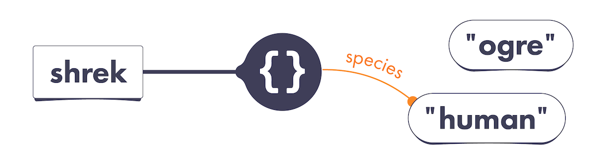

In this example, it is only the `shrek` variable wire itself that is real-only (`const`). It points at an object - and that object's properties can be mutated!

The usefulness of `const` is a hotly debated topic. Some prefer to ban `let` altogether and always use `const`. Others might say that programmers should be trusted to reassign their own variables. Whatever your preference may be, remember that `const` prevents variable reassignment - not object mutation.

# Is Mutation Bad?

I want to make sure you don't walk away with an idea that mutation is "bad". That would be a lazy oversimplification that obscures real understanding. If data changes over time, a mutation happens somewhere. The question is what gets mutated, where, and when. That's also a subject of much debate.

Mutation is "spooky action at distance". Changing `john.address.city` led to `console.log(sherlock.address.city)` printing something else.

**By the time you mutate an object, variables and properties may already be pointing at it. Your mutation affects any code "following" those wires later.**

This is both a blessing and a curse. Mutation makes it easy to change some data and immediately "see" the change across the whole program. However, undisciplined mutation makes it harder to predict what the program would do.

There is a school of thought that mutation is best contained to very narrow layer of your application. The downside is that you would likely write more boilerplate code to "pass things around". But the benefit, according to that philosophy, is that your program's behavior will become more predictable.

It's worth nothing that mutating just created objects is always okay because there are no other wires pointing at them yet. In other cases, I advise you to be very intentional about what you're mutating, and when. The extent to which you'll rely on mutation depends on your app's architecture.

# Recap

- Objects are never "nested" in our universe.
- Pay close attention to which wire is on the left side of assignment.
- Changing an object's property is also called mutating that object.
- If you mutate an object, your code will "see" that change via any wires pointing at that object. Sometimes, this may be what you want. However, mutating accidentally shared data may cause bugs.
- Mutating the objects you've just created in code is safe. Broadly, how much you'll use mutation depends on your app's architecture. Even if you won't use it a lot, it's worth your time to understand how it works.
- You can declare a variable with `const` instead of `let`. That allows you to enforce that this variable's wire always points at the same value. But remember that `const` does not prevent object mutation!

# Exercises

This module also has exercises for you to practice!

[here](https://eggheadio.typeform.com/to/Ql4IPM?email=andylauszp@gmail.com&ck_subscriber_id=746096254)
