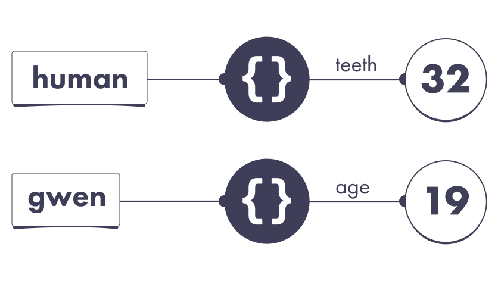
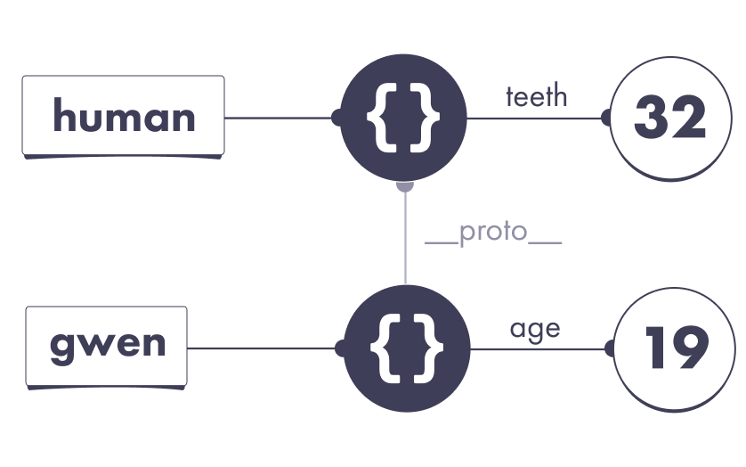
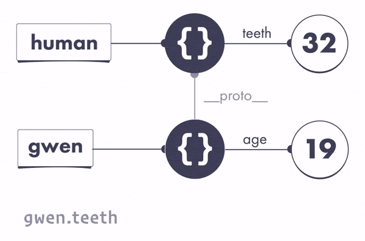
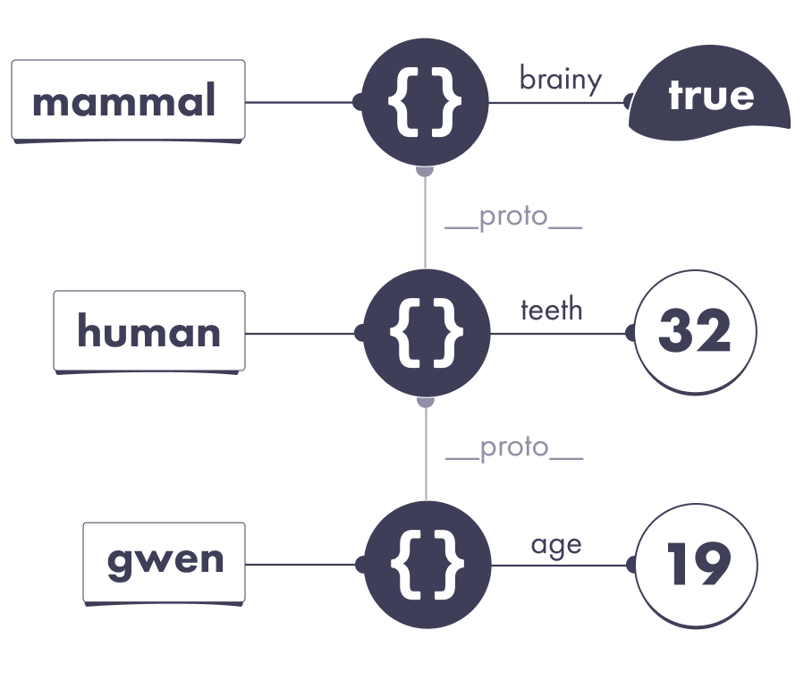
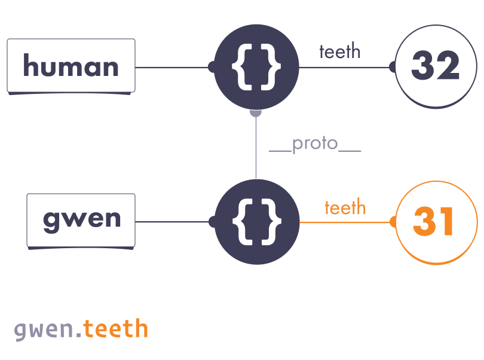
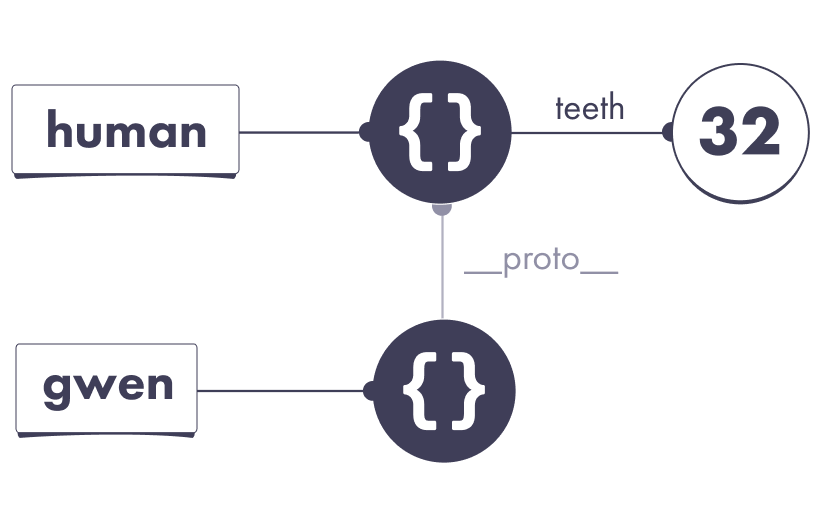
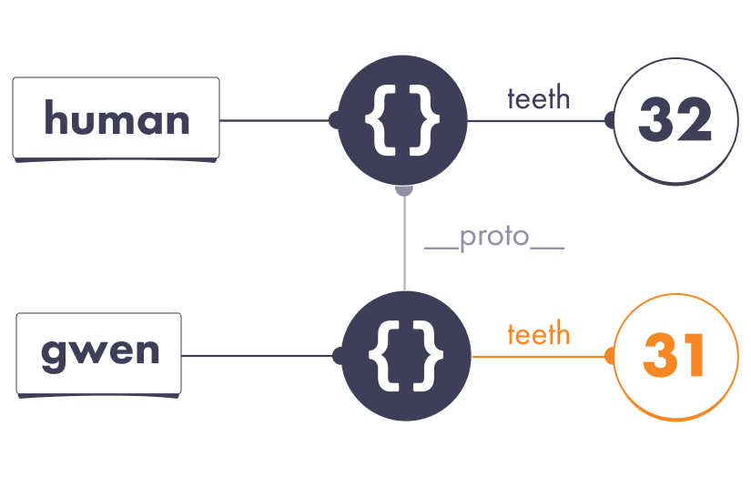
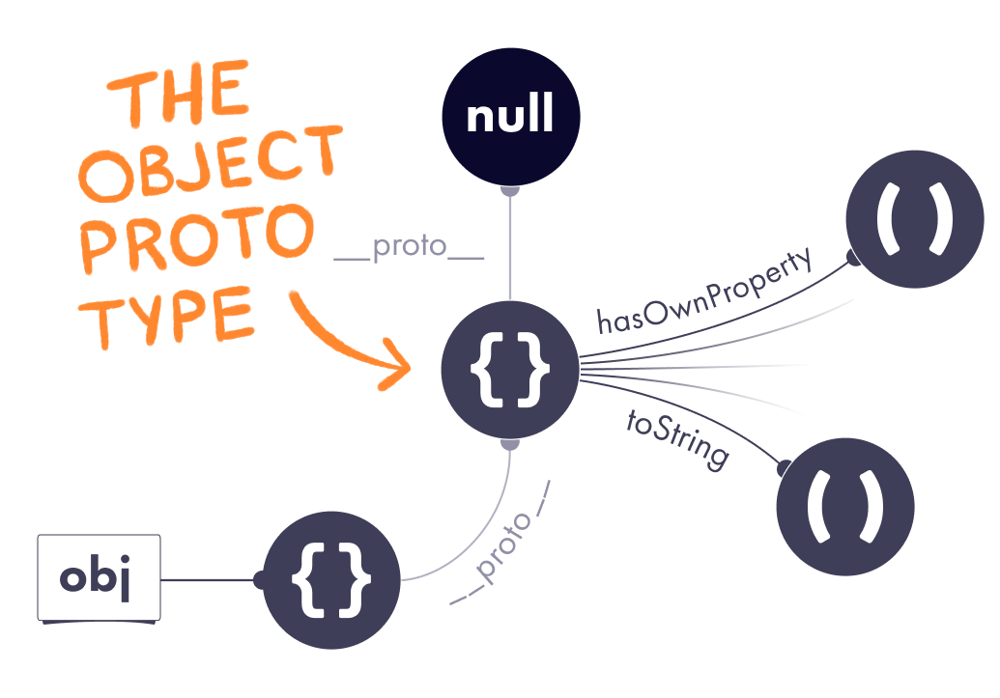
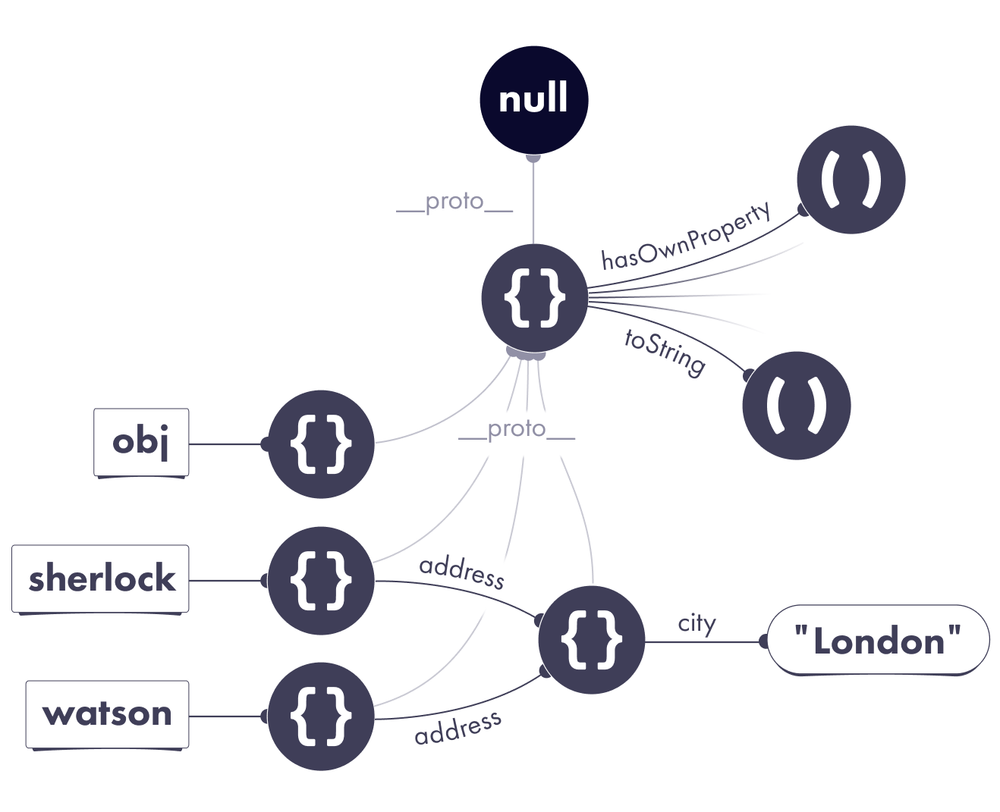
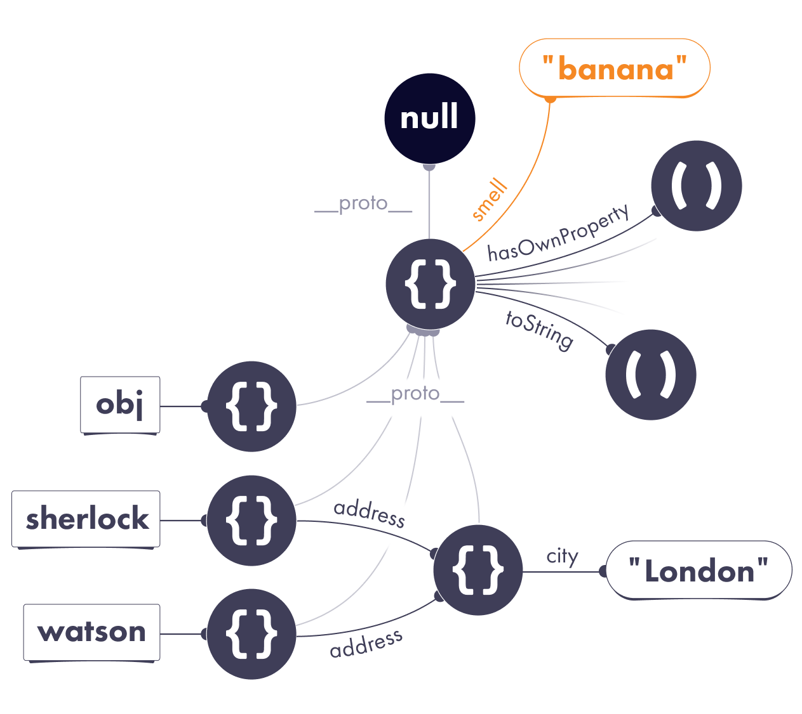

In the previous modules, we've covered objects, properties, and mutation. It's tempting to jump to other topics, but we're not quite done with objects yet!

Here is a small riddle to check our mental model:

```JavaScript
let pizza = {};

console.log(pizza.taste); //"pineapple"
```

Ask yourself: is this possible?

We have just created an empty object with `{}`. We definitely didn't set any properties on it before. So it seems like `pizza.taste` can't point to `"pineapple"`. We would expect `pizza.taste` to give us `undefined` instead. (We usually get `undefined` when a property doesn't exist, right?)

And yet, it is possible to add some code before these two lines that would cause `pizza.taste` to be `"pineapple"`! This may be a contrived example, but it shows that our mental model of the JavaScript universe is incomplete.

In this module, we'll introduce the concept of prototype. Prototypes explain what happens in this puzzle. More importantly, prototypes are at the heart of several other JavaScript features. Occasionally people neglect learning them because them seem too unusual. However, the core idea is remarkably simple.

# Prototypes

Here's a couple of variables pointing at a couple of objects:

```JavaScript
let human = {
    teeth: 32
}

let gwen = {
    age: 19
}
```

We can represent them visually in a familiar way:



In this example, `gwen` points at an object without a `teeth` property. According to the rules we've learned, if we read it, we get `undefined`:

```JavaScript
console.log(gwen.teeth); //undefined
```

But the story doesn't have to end here. Instead of the default behavior of returning `undefined`, we can instruct JavaScript to continue searching for our missing property on another object. We can do it with one line of code:

```JavaScript
let human = {
    teeth: 32
}

let gwen = {
    //We added this line:
    __proto__: human,
    age: 19
}
```

What is that mysterious `__proto__` property?

It represents the JavaScript concept of a prototype. Any JavaScript object may choose another object as a prototype. We will discuss what that means in practice very soon. For now, let's think of it as a special `__proto__` wire:



Take a moment to verify the diagram matches the code. We drew it just like we did in the past. The only new thing is the mysterious `__proto__` wire.

By specifying `__proto__` (also known as our object's prototype), we instruct JavaScript to continue looking for missing properties on that object instead.

# Prototypes in Action

Earlier, when we went looking for `gwen.teeth`, we got `undefined` because the `teeth` property doesn't exist on the object the `gwen` points at.

But thanks to that `__proto__: human` line, the answer is different now:

```JavaScript
let human = {
    teeth: 32
}

let gwen = {
    // "Look for other properties here"
    __proto__: human,
    age: 19
}

console.log(gwen.teeth); // 32
```

Now the sequence of steps looks like this:



1. Follow the `gwen` wire. It leads to an object.
2. Does this object have a `teeth` property?
   - No,
   - **But it has prototype.** Let's check it out.
3. Does that object have a `teeth` property?
   - Yes, it points at 32.
   - Therefore, the result of `gwen.teeth` is 32.

This is similar to how you might say at work: "I don't know, but Alice might know". With `__proto__`, you instruct JavaScript to "ask another object".

To check your understanding so far, write down your answers:

```JavaScript
let human = {
    teeth: 32
}

let gwen = {
    __proto__: human,
    age: 19
}

console.log(human.age); // undefined
console.log(gwen.age); // 19

console.log(human.teeth); // 32
console.log(gwen.teeth); // 32

console.log(human.tail); // undefined
console.log(gwen.tail); // undefined
```

Now let's check your answers.

The `human` variable points at an object that doesn't have an `age` property, so `human.age` is `undefined`. The `gwen` variable points at an object that does have an `age` property. That wire points at 19, so the value of `gwen.age` is 19:

```JavaScript
console.log(human.age); // undefined
console.log(gwen.age); // 19
```

The `human` variable points at object that has a `teeth` property, so the value of `human.teeth` is 32. The `gwen` variable points at an object that doesn't have a `teeth` property. However, that object has a prototype, which does have a `teeth` property. This is why the value of `gwen.teeth` is also 32.

```JavaScript
console.log(human.teeth); // 32
console.log(gwen.teeth); // 32
```

Neither of our objects have a `tail` property, so we get `undefined` for both:

```JavaScript
console.log(human.tail); // undefined
console.log(gwen.tail); // undefined
```

Note how although the value of `gwen.teeth` is 32, it doesn't mean `gwen` has a `teeth` property! Indeed, in this example, `gwen` does not have a `teeth` property. But its prototype object - the same one `human` points at - does.

This serves to remind us that `gwen.teeth` is an expression - a question to the JavaScript universe - and JavaScript will follow a sequence of steps to answer it. Now we know that these steps involve looking at the prototype.

# The Prototype Chain

A prototype isn't a special "thing" in JavaScript. A prototype is more like a relationship. An object may point at another object as its prototype.

This naturally leads to a question: but what if my object's prototype has its own prototype? And that prototype has its own prototype? Would that work?

The answer is that this is exactly how it works!

```JavaScript
let mammal = {
    brainy: true,
}

let human = {
    __proto__: mammal,
    teeth: 32
}

let gwen = {
    __proto__: human,
    age: 19
}

console.log(gwen.brainy); // true
```

We can see that JavaScript will search for the property on our object, then on its prototype, then on that object's prototype, and so on. We would only get `undefined` if we ran out of prototypes and still haven't found our property.



This is similar to how you might say at work: "I don't know, but Alice might know". But then Alice might say "Actually I don't know either, ask Bob". Eventually, you will either arrive at the answer or run out of people to ask!

This sequence of objects to "visit" is known as our object's prototype chain. (However, unlike a chain you might wear, prototype chains can't be circular!)

## Shadowing

Consider this slightly modified example:

```JavaScript
let human = {
    teeth: 32
}

let gwen = {
    __proto__: human,
    // This object has its own teeth property:
    teeth: 31
}
```

Both objects define a property called `teeth`, so the results are different:

```JavaScript
console.log(human.teeth); // 32
console.log(gwen.teeth); // 31
```

Note that `gwen.teeth` is 31. If `gwen` didn't have its own `teeth` property, we would look at the prototype. But because the object that `gwen` points at has its own `teeth` property, we don't need to keep searching for the answer.



In other words, once we find our property, **we stop the search.**

If you ever want to check if an object has its own property wire with a certain name, you can call a built-in function called `hasOwnProperty`. It returns `true` for "own" properties, and does not look at the prototypes. In our last example, both objects have their own `teeth` wires, so it is `true` for both:

```JavaScript
console.log(human.hasOwnProperty('teeth')); // true
console.log(gwen.hasOwnProperty('teeth')); // true
```

## Assignment

Consider this example:

```JavaScript
let human = {
    teeth: 32
}

let gwen = {
    __proto__: human,
    // Note: no own teeth property
}

console.log(human.teeth); // 32
console.log(gwen.teeth); // 32

gwen.teeth = 31;

console.log(human.teeth); // 32
console.log(gwen.teeth); // 31
```

Before the assignment, both expression result in 32:



Then we need to execute this assignment:

```JavaScript
gwen.teeth = 31;
```

Now the question is which wire does `gwen.teeth` correspond to? The answer is that, generally saying, assignments happen on the object itself.

So `gwen.teeth = 31` creates a new own property called `teeth` on the object that `gwen` points at. It doesn't have any effect on the prototype:



As a result, `human.teeth` is still 32, but `gwen.teeth` is now 31:

```JavaScript
console.log(human.teeth); // 32
console.log(gwen.teeth); // 31
```

We can summarize this behavior with a simple rule of thumb.

When we read a property that doesn't exist on our object, then we'll keep looking for it on the prototype chain. If we don't find it, we get `undefined`.

But when we write a property that doesn't exist on our object, that will create that property on our object. Generally saying, prototypes will not play a role.

## The Object Prototype

This object doesn't have prototype, right?

```JavaScript
let obj = {}
```

Try running this in your browser's console:

```JavaScript
let obj = {}
console.log(obj.__proto__);
```

Surprisingly, `obj.__proto__` is not `null` or `undefined`! Instead, you'll see a curious object with a bunch of properties, including `hasOwnProperty`.

**We're going to call that special object the Object Prototype:**



At first, this might be a bit mindblowing. Let that sink in. All this time we were thinking that `{}` creates an "empty" object. But it's not so empty, after all! It has a hidden `__proto__` wire that points at the Object Prototype by default.

This explains why the JavaScript objects seem to have "built-in" properties:

```JavaScript
let human = {
    teeth: 32
}
console.log(human.hasOwnProperty); // function hasOwnProperty() { }

console.log(human.toString); // function toString() { }
```

These "built-in" properties are nothing more than normal properties that exist on the Object Prototype. Our object's prototype is the Object prototype, which is why we can access them. (Their implementations are inside the JS engine.)

## An Object with No Prototype

We've just learned that all objects created with the `{}` syntax have the special `__proto__` wire set to a default Object Prototype. But we also know that we can customize the `__proto__`. You might wonder: can we set it to `null`?

```JavaScript
let weirdo = {
    __proto__: null
}
```

The answer is yes - this will produce an object that truly doesn't have a prototype, at all. As a result, it doesn't even have built-in object methods:

```JavaScript
console.log(weirdo.hasOwnProperty); // undefined
console.log(weirdo.toString); // undefined
```

You won't often want to create objects like this, if at all. However, the Object Prototype itself is exactly such an object. It is an object with no prototype.

## Polluting the Prototype

Now we know that all JavaScript objects get the same prototype by default. Let's briefly revisit our example from the module about Mutation:



This picture gives us an interesting insight. If JavaScript searches for missing properties on the prototype, and most objects share the same prototype, can we make new properties "appear" on all objects by mutating that prototype?

The answer is yes!

Let's add these two lines of code:

```JavaScript
let obj = {};
obj.__proto__.smell = 'banana';
```

We mutated the Object Prototype by adding a `smell` property to it. As a result, both detectives now appear to be using a banana-flavored perfume:

```JavaScript
console.log(sherlock.smell); // "banana"
console.log(watson.smell); // "banana"
```



Mutating a shared prototype like we just did is called prototype pollution.

In the past, prototype pollution was a popular way to extend JavaScript with custom features. However, over the years the web community realized that it is fragile and makes it hard to [add new language features](https://esdiscuss.org/topic/having-a-non-enumerable-array-prototype-contains-may-not-be-web-compatible?ck_subscriber_id=746096254). Prefer to avoid it.

Now you can solve the Pineapple Puzzle from the beginning of this module! Check your solution in DevTools.

# `__proto__` vs prototype

You might be wondering: what in the world is the `prototype` property? You might have seen `prototype` in the docs, e.g.[in the MDN page titles](https://developer.mozilla.org/en-US/docs/Web/JavaScript/Reference/Global_Objects/Array/filter?ck_subscriber_id=746096254).

I have bad news: the `prototype` property is almost entirely unrelated to the core mechanism of prototypes (which, as you might recall, are `__proto__`).

The `prototype` property is mostly relevant to explaining the `new` operator. I believe that this single unfortunate naming choice is the primary reason why so many people are confused by prototypes and give up on learning them.

# Why Does This Matter?

You might be wondering: why care about prototypes at all? Will you use them much? In practice, you probably won't use them directly. Don't get into the habit of writing `__proto__`. These examples only illustrated the mechanics. (In fact, even using the `__proto__` syntax directly itself is [discouraged](https://2ality.com/2015/09/proto-es6.html?ck_subscriber_id=746096254).)

Prototypes are a bit unusual, and most people and frameworks never really fully embraced them as a paradigm. Instead, people often used prototypes as mere building blocks for a traditional "class inheritance" model that's popular in other programming languages. In fact, it was so common that JavaScript added a class syntax as a convention that "hides" prototypes out of sight.

Still, you will notice prototypes hiding "beneath the surface" of classes and other JavaScript features. For example, here is a [snippet](https://gist.github.com/gaearon/a25fd42a1e6b4cc24851978df0a36571?ck_subscriber_id=746096254) of a JavaScript class rewritten with `__proto__` to demonstrate what's happening under the hood.

Personally, I don't use a lot classes in my daily coding, and I rarely deal with prototypes directly either. However, it helps to know how those features build on each other, and what happens when I read or set a property on an object.

# Recap

- When reading `obj.prop`, if `obj` doesn't have a `prop` property, JavaScript will look for `obj.__proto__.prop`, then it will look for `obj.__proto__.__proto__.prop`, and so on, until it either finds our property or reaches the end of the prototype chain.

- When writing to `obj.prop`, JavaScript will usually write to the object directly instead of traversing the prototype chain.

- We can use `obj.hasOwnProperty('prop')` to determine whether our object has an own property called `prop`. In other words, it means there is a property wire called `prop` attached to that object directly.

- We can "pollute" a prototype shared by many objects by mutating it. We can even do this to the Object Prototype - the default prototype for `{}` objects! But we shouldn't do that unless we're pranking out colleagues.

- You probably won't use prototypes much directly in practice. However, they are fundamental to how JavaScript objects work, so it is handy to understand their underlying mechanics. Some advanced JavaScript features, including classes, can be expressed in terms of prototypes.

# Exercises

This module also has exercises for you to practice!

[here](https://eggheadio.typeform.com/to/S7p8NB?email=andylauszp@gmail.com&ck_subscriber_id=746096254)

**Don't skip them !**

Even though you're probably familiar with the concept of prototypes, these exercises will help you cement the mental model we're building. We need this foundation before we can get to more complex topics.
